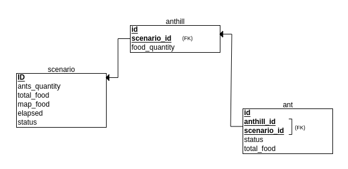

# Monitoring Ants
We build a pipeline to process and analyse data from our ants simulation scenarios.

## Executing the Pipeline

1. Install the requirements:
```
sudo apt install default-jdk 
sudo apt-get install docker-compose
pip install -r requirements.txt
pip install -r requirements_spark.txt
```

1. Start o rabbit mq:
```
cd PubSubscribe
sudo docker-compose up
```

1. In a new terminal, start the consumers with n process (n=20 in the exemple)
```
celery -A consumer worker -l info --concurrency=20
```

4. In a new terminal start the publisher/scenarios
with n scenarios (in the exemple n=20)
```
python3 setup_scenarios.py -n 20
```

1. Start the dashboard. Run:
```
cd Dashboard
streamlit run ndash.py
```

## Ants Simulation

The simulation was made with python. We have a ramdom size map, random number of ants, randomly positioned anthill and randomly positioned food with random quantity. In summary, we have a map, ants, a anthill and food with random parameters. 

The ants objective is to find food and store it in the anthill. Every time a ant is carring food, it drops pheromome, so the other ants can sense it and follow the pheromone path.

The pheromone have a timelife, so it will vanish after that time elapsed. If the food runs out, a new food position and quantity will be generted randomly. 

The simulation stops when the total food stored in the anthill is bigger than the total number of ants times 500. Then, a new scenario with new randomly generated parameters it automaticaly started. 

## Pipeline

The pipeline flow was modeled as:


### Database

The database relational schema is:



